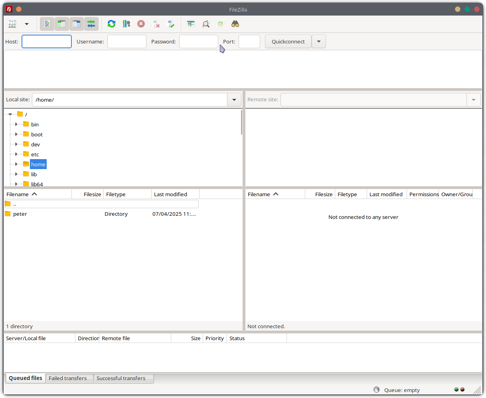
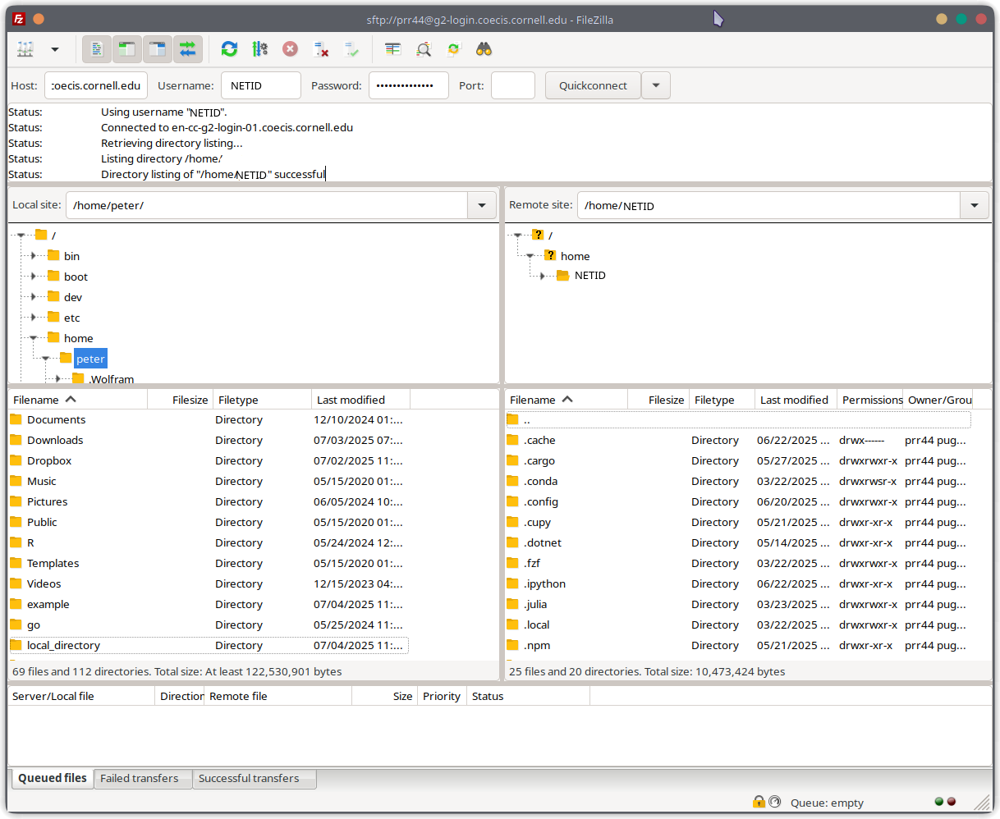

# Moving Files to and from the Cluster

We'll talk about two ways of moving files to and from the cluster: using the terminal
and using an application like FileZilla.

## Using the Terminal

There are a lot of ways to move files to and from the cluster, but the most common way is to just
use the `sftp` command. If I am in a directory on my local machine containing the file 
"local_file.txt"

```console
% ls

local_file.txt
```

I can use the `sftp` command to move this file to the cluster:

```console
% sftp <NETID>@g2-login.coecis.cornell.edu

sftp> cd /path/to/directory/on/cluster
sftp> put local_file.txt
```

This will ask you for your password, and then it will upload the file to the cluster with the put
command. Likewise, if you would like to download a file from the cluster, you can use the `get`
command:

```console
sftp> cd /path/to/directory/on/cluster
sftp> get cluster_file.txt
```

Then if you exit the `sftp` session using `quit`, you will see the file on your local machine:

```console
sftp> quit

% ls

cluster_file.txt
local_file.txt
```

If you want to move a whole directory, you can specify the `-r` flag to the `put` command:

```console
% ls
local_directory/

% sftp <NETID>@g2-login.coecis.cornell.edu

sftp> cd /path/to/directory/on/cluster
sftp> put -r local_directory
```

When moving a lot of large files, it is better to use the `rsync` command instead of `sftp`
because `rsync` allows you to continue from where you left off if the file transfer is interrupted.
Here is the basic syntax for using `rsync`:

```console
rsync -avzP <source> <destination>
```

The `-a` flag tells `rsync` to copy all files and directories recursively, the `-v` flag tells
`rsync` to be verbose, the `-z` flag tells `rsync` to compress the data being sent, and the `-P`
allows you to resume a file transfer if it is interrupted.

Here is an example of using `rsync` to move a directory from the cluster to your local machine:

```console
% rsync -avzP <NETID>@g2-login.coecis.cornell.edu:/path/to/directory/on/cluster/ /path/to/local/directory/
```

And here is an example of using `rsync` to move a directory from your local machine to the cluster:

```console
% rsync -avzP /path/to/local/directory/ <NETID>@g2-login.coecis.cornell.edu:/path/to/directory/on/cluster/
```

## Using FileZilla

FileZilla is a free application that allows you to transfer files and folders between your local
machine and the cluster. Under the hood, it uses the `sftp` protocol, so it is very similar to
the `sftp` command we used above, but it has a graphical user interface that makes it a bit
friendlier to use.

First, you will need to install FileZilla on your local machine by downloading the installer
from the [FileZilla website](https://filezilla-project.org/download.php?type=client).

When you have installed FileZilla, you can open it and you should see something like this:



At the top of the window, you will need to fill in the following fields:

- Host Name: g2-login.coecis.cornell.edu
- User Name: YOUR_NETID
- Password: YOUR_NETID_PASSWORD
- Port: 22


Then hit connect. If everything goes well, you should see something like this:



From there, you just need to navigate the directory on you local machine and to the directory
on the cluster that you would like to transfer files to and from, and then it's as simple as
dragging and dropping files between the two windows at the bottom of the interface.
